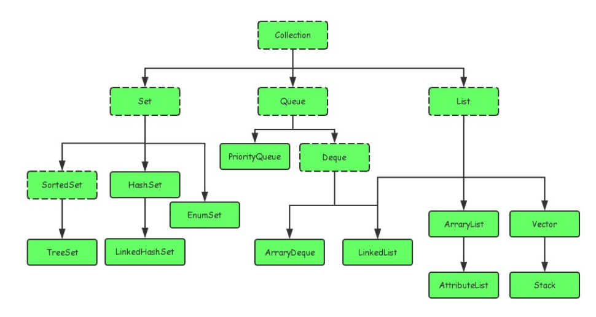
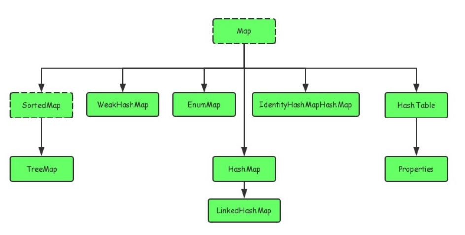

## Java集合框架   

Java集合大致分为四种:Set,List,Map,Queue    

Java集合就像是容器,可以把多个对象(其实是对象的引用,习惯上都称为对象)存进集合内.     

Java5增加了泛型后,Java集合就可以记住容器中对象的数据类型,使得编码更加简洁    

* Set   
    数据无序,不可重复   

* List   
    有序,可以重复     
    可以通过索引来访问其中的元素   
    默认按照元素的插入顺序来设置元素索引,比如第一个添加的元素索引为0,第二个为1    

* Map   
    有映射关系(key-value)      
    保存键值对,但是其中的key不能重复       
    key和value都可以是任意引用类型    

    * Map与Set集合的关系   
        如果Map中没有value值,实际上key的集合就构成了Set集合(不能重复,没有顺序)     
        实际上Map提供了`keySet()`方法用来返回Map中的key构成的Set集合     

* Queue    
    队列集合      
    先进先出(FIFO)        
    通常,队列不允许随机访问队列中的元素    

### Java集合类之间的继承关系   

主要从两个接口派生出来:`Collection`,`Map`    

        

    


### ArrayList   

"动态数组",自动扩容,开发时使用的频率非常高   


以数组实现,在超出一次固定大小后会扩容50%,使用下标来访问和操作元素`(get(i),set(i,e))`时性能很好,这是数组的基本优势    

* add方法    

    增加元素时,会将元素放到末尾    
    在每次增加时都会去判断一下当前list的长度,如果不满足需求就会自动扩容  

    ```java 
    /**
    * Default initial capacity.
    */
    //默认长度为10
    private static final int DEFAULT_CAPACITY = 10;


    /**
    * The array buffer into which the elements of the ArrayList are stored.
    * The capacity of the ArrayList is the length of this array buffer. Any
    * empty ArrayList with elementData == DEFAULTCAPACITY_EMPTY_ELEMENTDATA
    * will be expanded to DEFAULT_CAPACITY when the first element is added.
    */
    //list中的数据都存在这个对象数组中
    transient Object[] elementData; // non-private to simplify nested class access  


    /**
    * Increases the capacity to ensure that it can hold at least the
    * number of elements specified by the minimum capacity argument.
    *
    * @param minCapacity the desired minimum capacity
    */
    private void grow(int minCapacity) {
    // overflow-conscious code
    int oldCapacity = elementData.length;
    //扩容为1.5倍
    int newCapacity = oldCapacity + (oldCapacity >> 1);
    //如果1.5倍仍不满足需求,直接扩容到需求值
    if (newCapacity - minCapacity < 0)
        newCapacity = minCapacity;
    if (newCapacity - MAX_ARRAY_SIZE > 0)
        newCapacity = hugeCapacity(minCapacity);
        // minCapacity is usually close to size, so this is a win:
        elementData = Arrays.copyOf(elementData, newCapacity);
    }
    ```

* set,get方法    

    先进行index检查,然后再进行操作    

* remove方法     

    删除指定index上的元素    


### LinkedList    

双向链表实现,链表无容量限制,但是需要额外的链表操作   

就是除了首尾指针以外,每个节点都有两个指针,分别指向它的前驱和后继节点   

* set和get方法    

    ```java
    /**
     * Returns the element at the specified position in this list.
     *
     * @param index index of the element to return
     * @return the element at the specified position in this list
     * @throws IndexOutOfBoundsException {@inheritDoc}
     */
    public E get(int index) {
        checkElementIndex(index);
        return node(index).item;
    }

    /**
     * Replaces the element at the specified position in this list with the
     * specified element.
     *
     * @param index index of the element to replace
     * @param element element to be stored at the specified position
     * @return the element previously at the specified position
     * @throws IndexOutOfBoundsException {@inheritDoc}
     */
    public E set(int index, E element) {
        checkElementIndex(index);
        Node<E> x = node(index);
        E oldVal = x.item;
        x.item = element;
        return oldVal;
    }
    ```  

    都使用了node函数去定位到一个给定索引的节点,该函数时间复杂度为**O(n/2)**  

* 将LinkedList当作queue使用    

    因为LinkedList实现了Deque接口,相当于实现了队列结构,所以我们可以将LinkedList当作队列使用    

    队列是"先进先出",只允许从表的前端进行删除操作,在表的后端进行添加操作,在这种数据结构中,最先插入的数据是最先被删除的元素    

    在使用Queue时要尽量避免Collection中的add和remove方法,使用offer来加入元素,使用poll来获取并删除元素,它们的优点是通过返回值可以判断操作是否成功,add和remove方法操作失败后会抛出异常     

    * offer    
        在队列首加入元素   

    * poll    
        在队列尾部删除元素   

    * peek    
        只查看队首元素,不会进行删除    
        如果队列为空,返回null   

    * element   
        只查看队首元素,不会进行删除    
        如果队列为空,抛出异常         

### HashMap     

基于Map接口实现,允许null键/值,非同步,不保证有序(比如插入的顺序),也不保证序不随时间变化     

* put方法    
    先对key的hashCode()做hash,然后再计算index    
    如果没有碰撞,正常加入    
    如果发生碰撞,将转换数据结构    
    如果当前节点已经存在于表中,就替换oldValue(保证key唯一性)    

    


