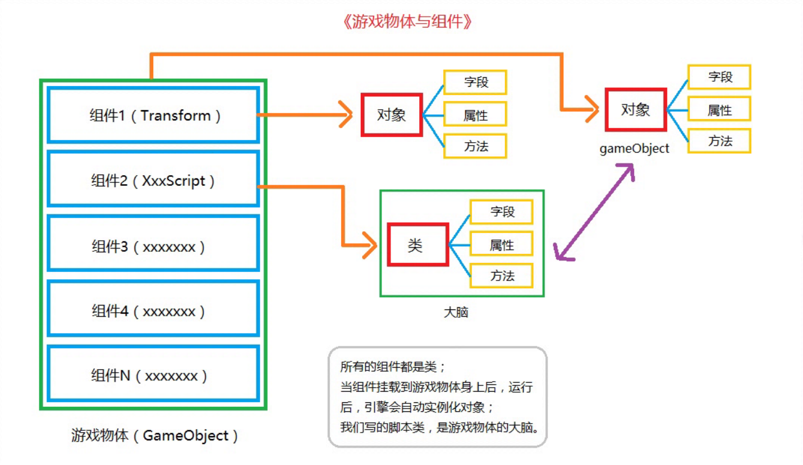
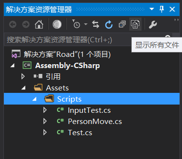
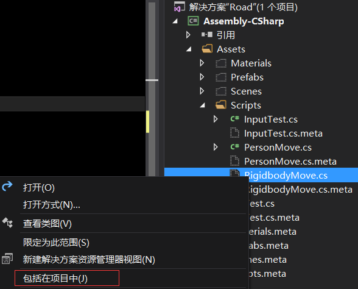

# Unity3D    

## 3D模型美化     

### 材质球和贴图   

* Material    
    物体的质地      
    文件后缀`.mat`    
* Texture    
    普通的图片,用于材质球的显示    
* 编辑材质球    
    * 选中要编辑的材质球,点击Inspector中的`Albedo`(纹理贴图即漫反射贴图),在弹出的texture界面中选择相应的贴图   
    * `Tiling`选项用来调整贴图分几块显示    

### 着色器Shader   

通过Shader来编辑材质球的效果      

### 预制体Prefab    

可以重复利用的物体     

文件后缀`.prefab`      

当场景中同时存在很多同一种预制体时,对其中一个进行编辑,然后点击该预制体的`Inspector`面板中的`Prefab`栏中的apply,就可以将刚才做出的修改应用到场景中所有的同类预制体上      


### 摄像机Camera    

相当于观察坐标系,观察区间有一个视锥体,所有在视锥体范围内的物体,在game视图下都能看到   

* Align with view   

    使摄像机位置直接定位到当前观察位置    

    快捷键**ctrl + shift + f**    

* 摄像机相关属性(Inspector面板中)      

    * Clear Flags 清除标记   
        指当前场景外部使用什么内容来包围,默认为Skybox(天空盒),也可以使用Solid Color(纯色),然后再Background选项中选择颜色    

    * Projection 投影模式    

        * Perspective 透视模式,3D场景使用   

        * Orthographic 正交模式,2D场景使用      

    * Clipping Planes 切割面   

        * Near 近切割面   

        * Far  远切割面   


### 灯光Light   

照亮当前Scene,使场景中产生阴影,增强立体感和真实感     

#### 方向光Directional Light   

用于模拟太阳光,自然光    
方向光可以照射到任何地方,即使在一个物体的背面,也会有太阳光的反射效果       

#### 点光源Point Light   

从一个点中心向四周发散光     

* Range属性    

    指定一个球体范围,该球体就是点光源的光发散范围    

#### 聚光灯Spot Light   

照射范围是一个圆锥体     

* Range属性   

    指定圆锥体的大小     

* Spot Angle聚光角    

    指定聚光灯圆锥体的伸展角度  

#### 灯光的属性   

* 类型Type     

    切换灯光的属性   

* 颜色Color   

    设置灯光的颜色   

* 强度Intensity     

    设置灯光的照射强度    

* 阴影类型 Shadow Type       


## 组件与脚本   

### 组件Component     

    


* Transform组件    

    变换,所有的场景对象都具备的一个组件,用于存储场景对象的基本信息   

    * Position 位置   

    * Rotation 旋转   

    * Scale 缩放      

* Rigidbody组件   

    刚体,添加了刚体组件的游戏物体,就有了重力属性,会做自由落体运动   
    
    * Mass 质量   
        设置物体的质量,质量单位为KG   

    * Drag 阻力    
        设置空气阻力,0表示无阻力,值很大时物体就会停止运动    
    
    * Angular Drag 角阻力   
        受到扭曲力时的空气阻力,值很大时物体就不会发生旋转或运动   

    * Use Gravity 使用重力         

    * 刚体常用方法   

        * AddForce   
            给刚体添加一个力,让刚体根据世界坐标系进行移动    
            `Rigidbody.AddForce(Vector3, ForceMode);`   
            参数Vector3表示力的方向和大小   
            ForceMode是枚举类型,表示力的模式    
            * Acceleration 加速度   
            * Force 普通力模式,通常用于设置真实的物理效果   
            * Impulse 冲击力模式,通常用于设置瞬间发生的力    
            * VelocityChange 速度的变化     

        * AddRelativeForce    
            给刚体添加一个力,让刚体按照自身坐标系进行运动    
            `Rigidbody.AddRelativeForce(Vector3, ForceMode);`       

        * FixedUpdate      
            该方法与`Start,Update`同级,都由系统调用     
            固定更新方法,所有和物理相关的操作都应写在`FixedUpdate`方法体内    
            固定更新时间间隔是0.02s,1秒执行50次     
            该方法与`Update`方法的区别是,`Update`方法是每帧执行一次,而且每帧的时间是不固定的,要根据当前画面中的内容复杂程度而定    
            **在Update方法执行物理操作,会出现卡顿现象**    

            更新时间间隔在Time面板中的Fixed TimeStep中设置     

* Collider组件    

    碰撞体,给一个物体添加了刚体组件后,就会使该物体的运动带上物体特性,这个物体特性真正的触发者其实是碰撞体   

    当两个带有刚体组件的游戏对象进行碰撞后,实际上是两个物体的碰撞体进行了作用   
    碰撞体可以理解为模型的"外骨骼"     

    **模型只要添加了刚体组件,就必须添加碰撞体组建,否则该物体在场景内就无意义,而且我们直接创建的游戏对象,默认都会加上碰撞体组建,然后根据用户需要自行添加刚体组件来触发物理效果**      

    碰撞体分类   

    * Box Collider     
        盒型碰撞体,形状为立方体型    

        * Center 中心点   
        * Size 碰撞体大小    

    * Sphere Collider  
        球型碰撞体   

        * Radius 半径,用来设置大小   
    
    * Capsule Collider    
        胶囊碰撞体    
        
        * Height 设置高度   
        * Direction 设置碰撞体的轴向   

    * Mesh Collider   
        网格碰撞体,用于包裹复杂结构的模型   

        * Mesh 网格属性
            根据指定的网格属性,给当前物体生成碰撞体     

* MeshFilter组件   
    网格过滤器  
    该组件只有一个`Mesh`属性,用于设置当前物体使用哪个模型进行展示    
    这里的网格Mesh可以看作是一个模型      

* MeshRenderer组件    
    网格渲染器    
    该组件用于渲染显示模型      

    * Cast Shadows 投射阴影   
    * Receive Shadows 接收阴影   
    * 


### Script脚本   

* Start()方法   

    当游戏运行起来就会执行一次   

* Update()方法   

    循环调用方法,每帧调用一次,一秒钟大概执行60次    

* Debug.Log()方法  

    在Unity内置的Console输出调试信息   

#### 获取键盘输入    

返回值: bool类型  
参数: KeyCode Enum类型   
键码,保存了键盘上按键的索引码   

* Input.GetKey() 按下某键后,持续返回true  
* Input.GetKeyDown() 按下某键的一瞬间,返回true   
* Input.GetKeyUp() 抬起某键的一瞬间,返回true     

#### 获取鼠标输入   

返回值: bool类型   
参数: 鼠标按键索引值   
0 -> 左键, 1 -> 右键, 2 -> 中键    

* Input.GetMouseButton() 按下某键后,持续返回true   
* Input.GetMouseButtonDown() 按下某键的一瞬间,返回true   
* Input.GetMouseButtonUp() 抬起某键的一瞬间,返回true    

#### 获取相应组件的引用   

返回值:某个gameobject的某个组件的引用   
参数:组件类型   

* gameObject.GetComponent<T>()    

#### 移动物体位置   

* Transform.Translate(Vector3, Space)    

参数:   

* Vector3表示方向向量    
    比如Vector3.forward表示物体前方   

* Space枚举类型   
    表示当前移动方向相对于物体自身坐标系还是世界坐标系   

    * Space.Self  
    * Space.World     

* 使用WASD四键控制游戏物体前后左右移动   

    ```Csharp
    public class PersonMove : MonoBehaviour
    {
        private Transform mTransform;

        // Use this for initialization
        void Start()
        {
            mTransform = gameObject.GetComponent<Transform>();
        }

        // Update is called once per frame
        void Update()
        {
            if (Input.GetKey(KeyCode.W))
            {
                mTransform.Translate(Vector3.forward * 0.1f, Space.Self);
            }

            if (Input.GetKey(KeyCode.S))
            {
                mTransform.Translate(Vector3.back * 0.1f, Space.Self);
            }

            if (Input.GetKey(KeyCode.A))
            {
                mTransform.Translate(Vector3.left * 0.1f, Space.Self);
            }

            if (Input.GetKey(KeyCode.D))
            {
                mTransform.Translate(Vector3.right * 0.1f, Space.Self);
            }
        }
    }
    ```  

* 使用刚体移动物体   

    * 使用刚体移动物体,物体是根据世界坐标系的方向进行移动的    
    * 使用刚体移动物体,物体会触发相关物理事件,比如碰撞等等   

    `Rigidbody.MovePosition(Vector3)`     

    * 参数: 
        使用刚体组件移动物体时,参数中的Vector3要使用**当前位置 + 方向**的方式    
        当前位置使用`Transform.Postion`获得       

        比如:  
        ```Csharp
        if (Input.GetKey(KeyCode.W))
            mRigidbody.MovePosition(mTransform.position +
             Vector3.forward * 0.2f);
        ```  
        这里给`Vector3.forward`乘上了0.2f是因为刚体移动速度太快,相当于每帧移动一个单位       


### 碰撞事件Collision    

当使用一个用刚体控制的物体与另一个物体碰撞时,就会触发碰撞事件,**目标物体必须带有Collider组件**      

碰撞事件检测方法    

* OnCollisionEnter(Collision)    
    当碰撞开始时调用,只会调用一次    
* OnCollisionExit(Collision)        
    当碰撞结束时调用,只会调用一次   
* OnCollisionStay(Collision)     
    当碰撞进行中,会一直调用该方法    

* Collision参数   

    该参数用来传递碰撞对象    
    * Collison.gameObject 属性   
        表示与当前物体碰撞的物体的引用    
    * gameObject.name 属性   
        表示当前物体的名字       

### 触发事件      
将碰撞体Collider组件面板上的`isTrigger`选项选中,当前物体的碰撞体就变成了触发器    

移动的带有刚体组件的物体会穿透已变成触发器的物体  

当一个用刚体控制的物体进入另一个物体的触发器范围内时,就会发生触发事件    

触发事件检测方法   

* OnTriggerEnter(Collider)   
    当进入触发范围时开始调用,只调用一次   
* OnTriggerExit(Collider)     
    当离开触发范围时开始调用,只调用一次    
* OnTriggerStay(Collider)     
    保持在触发范围内时,持续调用       

### 查找游戏物体    

`GameObject.Find(string);`    
在当前Hierarchy下通过对象名字查找游戏物体,并返回游戏物体引用    

## Unity3D操作问题解决记录   

在学习过程中遇到了一些操作上的问题,这里做一下记录    

1. 在Unity中Scripts文件夹下新创建了一个脚本,双击该脚本在VS或者其他编辑器中打开时,并不能马上包含在项目目录中,就不能得到相应的代码提示和错误检查,比如在Vs中会提示当前库目录为Csharp杂项问题    

* 解决办法   
    在VS解决方案管理器中点击显示所有文件,找到当前脚本文件,右击选择包含在项目中     

       
         

